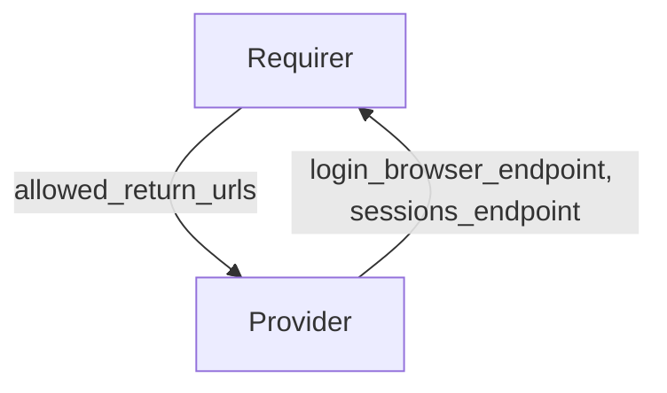

# `session_auth`

## Overview

This relation interface describes the expected behavior of the session_authentication relation. This interface is only meant to be used when connecting the Kratos and Oathkeeper components of the Canonical Identity Platform.

## Usage

Through the interface, Kratos will provide Oathkeeper with endpoints to facilitate authentication, and to determine if a session is authenticated. In turn Oathkeeper will provide the return urls of its clients to Kratos.

## Direction

The interface will consist of a provider and a requirer. Kratos is always expected to be the provider. The provider is expected to supply the login_browser_endpoint,
and the sessions_endpoint to the requirer. The provider is expected to update the endpoints in case of changes in said endpoints. Oathkeeper is always expected to be the requirer.
The requirer is expected to provide the full list of allowed_return_urls to the provider. The requirer is expected to update allowed_return_urls in case of change.

## Behavior

Both the requirer and the provider need to adhere to a certain set of criteria to be considered compatible with the interface:

### Provider

- Is expected to serve login_browser_endpoint, and sessions_endpoint endpoints.
- Is expected to consume the allowed return urls, and make the necessary updates.

### Requirer

- Is expected to serve allowed return urls in the allowed_return_urls field.
- Is expected to consume the login_browser_endpoint, and sessions_endpoint endpoints, and make the necessary updates.

## Relation Data

[\[Pydantic Schema\]](./schema.py)